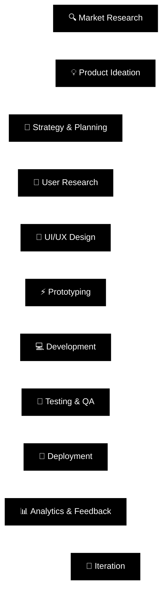

# Hi there, I'm Ayush Ahire! 👋

  
  

## 🚀 About Me

**I'm a Product Developer passionate about creating innovative digital solutions that solve real-world problems. I bridge the gap between design and development, turning ideas into user-centric products.**

🔭 Currently working on **AI-powered web applications** and **mobile solutions**  
🌱 Exploring **Next.js 14**, **React Server Components**, **TypeScript**, and **AI/ML integration**  
💡 Specialized in **Product Strategy**, **User Experience Design**, and **Full-Stack Development**  
🎯 Focused on building **scalable products** with excellent **user experience**  
📧 Reach me at: **ayushahire055@gmail.com**

## 🛠️ Tech Stack & Skills

### 💻 Programming Languages

  
  
  
  
  
  

### 🌐 Frontend Development

  
  
  
  
  
  

### ⚡ Backend Development

  
  
  
  
  

### 📱 Mobile Development

  
  
  

### 🗄️ Databases

  
  
  
  

### ☁️ Cloud & DevOps

  
  
  
  
  

### 🎨 Design & Prototyping

  
  
  
  
  

### 🤖 AI/ML & Data Science

  
  
  

## 🏆 Product Development Expertise

<table>
  <tr>
    <td align="center" width="33%">
      
       <b>Product Strategy</b>
       Market Research, User Analysis, Product Roadmapping
    </td>
    <td align="center" width="33%">
      
       <b>UX/UI Design</b>
       User Research, Prototyping, Design Systems
    </td>
    <td align="center" width="33%">
      
       <b>Full-Stack Development</b>
       Frontend, Backend, Mobile, DevOps
    </td>
  </tr>
</table>

## 📊 GitHub Analytics Dashboard

### 📈 Performance Metrics

<table>
  <tr>
    <td align="center">
      
    </td>
    <td align="center">
      
    </td>
  </tr>
</table>

  

  

## 🏆 GitHub Achievement Gallery

### 🎯 Trophy Collection

<table>
  <tr>
    <td align="center" width="25%">
      
       Expert in multiple programming languages
    </td>
    <td align="center" width="25%">
      
       Consistent contribution streaks
    </td>
    <td align="center" width="25%">
      
       Leading edge technology adoption
    </td>
    <td align="center" width="25%">
      
       Active open source contributor
    </td>
  </tr>
</table>

## 🚀 Product Development Lifecycle

### ⚡ Development Process

### 🎯 My Product Development Philosophy

<table>
  <tr>
    <td align="center" width="25%">
      
       <b>User-Centric</b>
       Every decision starts with user needs
    </td>
    <td align="center" width="25%">
      
       <b>Data-Driven</b>
       Metrics guide our product evolution
    </td>
    <td align="center" width="25%">
      
       <b>Agile & Fast</b>
       Rapid iteration and continuous delivery
    </td>
    <td align="center" width="25%">
      
       <b>Scalable</b>
       Built for growth and future needs
    </td>
  </tr>
</table>

## 🎯 Current Focus Areas

### 🔥 What I'm Working On

<table>
  <tr>
    <td align="center" width="50%">
      
       <b>AI-Powered Applications</b>
       Integrating LLMs and ML models into scalable web applications
    </td>
    <td align="center" width="50%">
      
       <b>Cross-Platform Solutions</b>
       Building unified experiences across web, mobile, and desktop
    </td>
  </tr>
  <tr>
    <td align="center" width="50%">
      
       <b>Design Systems</b>
       Creating consistent and accessible component libraries
    </td>
    <td align="center" width="50%">
      
       <b>Performance Optimization</b>
       Enhancing user experience through technical excellence
    </td>
  </tr>
</table>

### 🌟 Featured Technologies I'm Exploring

  
  
  
  
  
  

## 📫 Let's Connect!

### 🤝 Get In Touch

  
  
  
  

---

### Thanks for visiting! 😊 Let's build something amazing together! 🚀

<i>⭐ From <a href="https://github.com/ayushahire565">ayushahire565</a> with ❤️</i>

