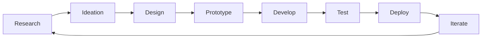

# Hi there, I'm Ayush Ahire! 👋

  

  
  

## 🚀 About Me

I'm a **Product Developer** passionate about creating innovative digital solutions that solve real-world problems. I bridge the gap between design and development, turning ideas into user-centric products.

- 🔭 Currently working on **AI-powered web applications** and **mobile solutions**
- 🌱 Exploring **Next.js 14**, **React Server Components**, **TypeScript**, and **AI/ML integration**
- 💡 Specialized in **Product Strategy**, **User Experience Design**, and **Full-Stack Development**
- 🎯 Focused on building **scalable products** with excellent **user experience**
- 📧 Reach me at: **ayushahire055@gmail.com**

## 🛠️ Tech Stack & Skills

### 💻 Programming Languages

  
  
  
  
  
  

### 🌐 Frontend Development

  
  
  
  
  
  

### ⚡ Backend Development

  
  
  
  
  

### 📱 Mobile Development

  
  
  

### 🗄️ Databases

  
  
  
  

### ☁️ Cloud & DevOps

  
  
  
  
  

### 🎨 Design & Prototyping

  
  
  
  
  

### 🤖 AI/ML & Data Science

  
  
  

## 🏆 Product Development Expertise

<table>
  <tr>
    <td align="center" width="33%">
      
       <b>Product Strategy</b>
       Market Research, User Analysis, Product Roadmapping
    </td>
    <td align="center" width="33%">
      
       <b>UX/UI Design</b>
       User Research, Prototyping, Design Systems
    </td>
    <td align="center" width="33%">
      
       <b>Full-Stack Development</b>
       Frontend, Backend, Mobile, DevOps
    </td>
  </tr>
</table>

## 📊 GitHub Analytics

  
  

  

  

## 🏆 GitHub Trophies

  

## 📈 Product Development Process

## 🎯 Current Focus Areas

- 🚀 **AI-Powered Applications**: Integrating LLMs and ML models into web applications
- 📱 **Cross-Platform Development**: Building scalable mobile and web solutions
- 🎨 **Design Systems**: Creating consistent and accessible user interfaces
- ⚡ **Performance Optimization**: Enhancing user experience through technical excellence
- 🌐 **Web3 & Blockchain**: Exploring decentralized application development

## 📫 Let's Connect!

  
  
  

---

  

  <i>⭐ From <a href="https://github.com/ayushahire565">ayushahire565</a> with ❤️</i>

