# Hi there, I'm Ayush Ahire! 👋

  
  
  

## 🚀 About Me

**I'm a Product Developer passionate about creating innovative digital solutions that solve real-world problems. I bridge the gap between design and development, turning ideas into user-centric products that make a difference.**

🔭 Currently working on **AI-powered web applications** and **scalable SaaS products**  
🌱 Exploring **Next.js 15**, **React Server Components**, **TypeScript**, **AI/ML integration**, and **Web3 technologies**  
💡 Specialized in **Product Strategy**, **User Experience Design**, **Full-Stack Development**, and **System Architecture**  
🎯 Focused on building **scalable, performant products** with exceptional **user experience**  
🏆 **2+ years** of experience in product development and full-stack engineering  
📧 Reach me at: **ayushahire055@gmail.com**

## 🛠️ Tech Stack & Expertise

### 💻 Programming Languages

  

### 🌐 Frontend Development

  

### ⚡ Backend Development

  

### 📱 Mobile & Desktop Development

  

### 🗄️ Databases & Storage

  

### ☁️ Cloud & DevOps

  

### 🎨 Design & Prototyping

  

### 🤖 AI/ML & Data Science

  
  
  
  

## 🏆 Product Development Excellence

### 🎯 My Core Competencies

<table>
  <tr>
    <td align="center" width="25%">
      
       <b>Product Strategy</b>
       Market Research • User Analysis • Product Roadmapping • Competitive Intelligence
    </td>
    <td align="center" width="25%">
      
       <b>UX/UI Design</b>
       User Research • Prototyping • Design Systems • Accessibility
    </td>
    <td align="center" width="25%">
      
       <b>Full-Stack Development</b>
       Frontend • Backend • Mobile • DevOps • Architecture
    </td>
    <td align="center" width="25%">
      
       <b>Growth & Analytics</b>
       Performance Metrics • A/B Testing • User Engagement • SEO
    </td>
  </tr>
</table>

## 📊 GitHub Analytics Dashboard

### 📈 Performance Insights

<table>
  <tr>
    <td align="center">
      
    </td>
    <td align="center">
      
    </td>
  </tr>
</table>

 

  

  

## 🏆 Achievement Gallery

### 🎯 Trophy Collection

  

### 🌟 Achievement Highlights

<table>
  <tr>
    <td align="center" width="25%">
      
       <b>Multi-Language Expert</b>
       Proficient in 8+ programming languages
    </td>
    <td align="center" width="25%">
      
       <b>Top Contributor</b>
       Consistent contribution streaks
    </td>
    <td align="center" width="25%">
      
       <b>Innovation Leader</b>
       Early adopter of cutting-edge tech
    </td>
    <td align="center" width="25%">
      
       <b>Open Source Advocate</b>
       Active community contributor
    </td>
  </tr>
</table>

## 🚀 Product Development Lifecycle

### ⚡ My Development Philosophy

```mermaid
%%{init: {'theme':'dark', 'themeVariables': {'primaryColor': '#00d9ff', 'primaryTextColor': '#ffffff', 'primaryBorderColor': '#00d9ff', 'lineColor': '#00d9ff', 'sectionBkgColor': '#0d1117', 'altSectionBkgColor': '#161b22', 'gridColor': '#30363d', 'tertiaryColor': '#0d1117', 'background': '#0d1117', 'mainBkg': '#0d1117', 'secondBkg': '#161b22'}}}%%

flowchart TD
    A[🔍 Market Research] --> B[💡 Product Ideation]
    B --> C[🎯 Strategy & Planning]
    C --> D[👥 User Research]
    D --> E[🎨 UI/UX Design]
    E --> F[⚡ Prototyping]
    F --> G[💻 Development]
    G --> H[🧪 Testing & QA]
    H --> I[🚀 Deployment]
    I --> J[📊 Analytics & Feedback]
    J --> K[🔄 Iteration & Optimization]
    K --> B
    
    style A fill:#0d1117,stroke:#00d9ff,stroke-width:2px,color:#ffffff
    style B fill:#0d1117,stroke:#00d9ff,stroke-width:2px,color:#ffffff
    style C fill:#0d1117,stroke:#00d9ff,stroke-width:2px,color:#ffffff
    style D fill:#0d1117,stroke:#00d9ff,stroke-width:2px,color:#ffffff
    style E fill:#0d1117,stroke:#00d9ff,stroke-width:2px,color:#ffffff
    style F fill:#0d1117,stroke:#00d9ff,stroke-width:2px,color:#ffffff
    style G fill:#0d1117,stroke:#00d9ff,stroke-width:2px,color:#ffffff
    style H fill:#0d1117,stroke:#00d9ff,stroke-width:2px,color:#ffffff
    style I fill:#0d1117,stroke:#00d9ff,stroke-width:2px,color:#ffffff
    style J fill:#0d1117,stroke:#00d9ff,stroke-width:2px,color:#ffffff
    style K fill:#0d1117,stroke:#00d9ff,stroke-width:2px,color:#ffffff
```

### 💎 Core Values & Principles

<table>
  <tr>
    <td align="center" width="20%">
      
       <b>User-First</b>
       Every decision prioritizes user value and experience
    </td>
    <td align="center" width="20%">
      
       <b>Data-Driven</b>
       Metrics and analytics guide product decisions
    </td>
    <td align="center" width="20%">
      
       <b>Ship Fast</b>
       Rapid prototyping and iterative development
    </td>
    <td align="center" width="20%">
      
       <b>Scale Smart</b>
       Built for growth, performance, and maintainability
    </td>
    <td align="center" width="20%">
      
       <b>Learn & Adapt</b>
       Continuous learning and technology evolution
    </td>
  </tr>
</table>

## 🎯 Current Focus & Innovation Areas

### 🔥 What I'm Building

<table>
  <tr>
    <td align="center" width="50%">
      
       <b>AI-First Products</b>
       Building intelligent applications that leverage LLMs, computer vision, and machine learning to solve complex problems
    </td>
    <td align="center" width="50%">
      
       <b>Web3 & Blockchain</b>
       Exploring decentralized applications, smart contracts, and the future of digital ownership
    </td>
  </tr>
  <tr>
    <td align="center" width="50%">
      
       <b>Cross-Platform Ecosystems</b>
       Creating unified experiences across web, mobile, desktop, and emerging platforms like AR/VR
    </td>
    <td align="center" width="50%">
      
       <b>Performance Engineering</b>
       Optimizing for speed, accessibility, and user experience through advanced web technologies
    </td>
  </tr>
</table>

### 🌟 Cutting-Edge Technologies I'm Mastering

  
  
  
  

  
  
  
  

  
  
  
  

## 💼 Product Portfolio Highlights

### 🎨 Featured Projects

<table>
  <tr>
    <td align="center" width="33%">
      
       <b>AI-Powered SaaS</b>
       Full-stack platform with AI integration, real-time collaboration, and analytics dashboard
       <i>Next.js • TypeScript • OpenAI • PostgreSQL</i>
    </td>
    <td align="center" width="33%">
      
       <b>Cross-Platform Mobile</b>
       React Native app with offline-first architecture and seamless synchronization
       <i>React Native • Redux • Firebase • Push Notifications</i>
    </td>
    <td align="center" width="33%">
      
       <b>Blockchain DApp</b>
       Decentralized application with smart contracts and token integration
       <i>React • Solidity • Web3.js • MetaMask</i>
    </td>
  </tr>
</table>

## 📫 Let's Build Something Amazing Together!

### 🤝 Connect With Me

  
  
  
  
  

### 💬 Open to Opportunities

  
  
  
  

 

---

### Thanks for visiting! 😊 Ready to turn ideas into reality! 🚀

<i>⭐ From <a href="https://github.com/ayushahire565">ayushahire565</a> with ❤️ and lots of ☕</i>

