# Hi there, I'm Ayush Ahire! 👋

  

  

  
  

## 🚀 About Me

I'm a **Product Developer** passionate about creating innovative digital solutions that solve real-world problems. I bridge the gap between design and development, turning ideas into user-centric products.

- 🔭 Currently working on **AI-powered web applications** and **mobile solutions**
- 🌱 Exploring **Next.js 14**, **React Server Components**, **TypeScript**, and **AI/ML integration**
- 💡 Specialized in **Product Strategy**, **User Experience Design**, and **Full-Stack Development**
- 🎯 Focused on building **scalable products** with excellent **user experience**
- 📧 Reach me at: **ayushahire055@gmail.com**

## 🛠️ Tech Stack & Skills

### 💻 Programming Languages

  
  
  
  
  
  

### 🌐 Frontend Development

  
  
  
  
  
  

### ⚡ Backend Development

  
  
  
  
  

### 📱 Mobile Development

  
  
  

### 🗄️ Databases

  
  
  
  

### ☁️ Cloud & DevOps

  
  
  
  
  

### 🎨 Design & Prototyping

  
  
  
  
  

### 🤖 AI/ML & Data Science

  
  
  

## 🏆 Product Development Expertise

<table>
  <tr>
    <td align="center" width="33%">
      
       <b>Product Strategy</b>
       Market Research, User Analysis, Product Roadmapping
    </td>
    <td align="center" width="33%">
      
       <b>UX/UI Design</b>
       User Research, Prototyping, Design Systems
    </td>
    <td align="center" width="33%">
      
       <b>Full-Stack Development</b>
       Frontend, Backend, Mobile, DevOps
    </td>
  </tr>
</table>

## 📊 GitHub Analytics Dashboard

  <h3>📈 Performance Metrics</h3>

  <table>
    <tr>
      <td align="center">
        
      </td>
      <td align="center">
        
      </td>
    </tr>
  </table>

  

 

  

 

  

## 🏆 GitHub Achievement Gallery

  <h3>🎯 Trophy Collection</h3>

  

  

  <table>
    <tr>
      <td align="center" width="25%">
        
         Expert in multiple programming languages
      </td>
      <td align="center" width="25%">
        
         Consistent contribution streaks
      </td>
      <td align="center" width="25%">
        
         Leading edge technology adoption
      </td>
      <td align="center" width="25%">
        
         Active open source contributor
      </td>
    </tr>
  </table>

## 🚀 Product Development Lifecycle

```mermaid
%%{init: {'theme':'dark', 'themeVariables': {'primaryColor': '#ffffff', 'primaryTextColor': '#000000', 'primaryBorderColor': '#ffffff', 'lineColor': '#ffffff', 'sectionBkgColor': '#0d1117', 'altSectionBkgColor': '#161b22', 'gridColor': '#21262d', 'tertiaryColor': '#21262d', 'background': '#0d1117', 'mainBkg': '#0d1117', 'secondBkg': '#161b22'}}}%%

flowchart TD
    A[🔍 Market Research] --> B[💡 Product Ideation]
    B --> C[🎯 Strategy & Planning]
    C --> D[👥 User Research]
    D --> E[🎨 UI/UX Design]
    E --> F[⚡ Prototyping]
    F --> G[💻 Development]
    G --> H[🧪 Testing & QA]
    H --> I[🚀 Deployment]
    I --> J[📊 Analytics & Feedback]
    J --> K[🔄 Iteration]
    K --> B
    
    style A fill:#0d1117,stroke:#ffffff,stroke-width:2px,color:#ffffff
    style B fill:#0d1117,stroke:#ffffff,stroke-width:2px,color:#ffffff
    style C fill:#0d1117,stroke:#ffffff,stroke-width:2px,color:#ffffff
    style D fill:#0d1117,stroke:#ffffff,stroke-width:2px,color:#ffffff
    style E fill:#0d1117,stroke:#ffffff,stroke-width:2px,color:#ffffff
    style F fill:#0d1117,stroke:#ffffff,stroke-width:2px,color:#ffffff
    style G fill:#0d1117,stroke:#ffffff,stroke-width:2px,color:#ffffff
    style H fill:#0d1117,stroke:#ffffff,stroke-width:2px,color:#ffffff
    style I fill:#0d1117,stroke:#ffffff,stroke-width:2px,color:#ffffff
    style J fill:#0d1117,stroke:#ffffff,stroke-width:2px,color:#ffffff
    style K fill:#0d1117,stroke:#ffffff,stroke-width:2px,color:#ffffff
```

  <h3>⚡ Development Process</h3>

### 🎯 My Product Development Philosophy

  <table>
    <tr>
      <td align="center" width="25%">
        
         <b>User-Centric</b>
         Every decision starts with user needs
      </td>
      <td align="center" width="25%">
        
         <b>Data-Driven</b>
         Metrics guide our product evolution
      </td>
      <td align="center" width="25%">
        
         <b>Agile & Fast</b>
         Rapid iteration and continuous delivery
      </td>
      <td align="center" width="25%">
        
         <b>Scalable</b>
         Built for growth and future needs
      </td>
    </tr>
  </table>

## 🎯 Current Focus Areas

  <h3>🔥 What I'm Working On</h3>

  <table>
    <tr>
      <td align="center" width="50%">
        
         <b>AI-Powered Applications</b>
         Integrating LLMs and ML models into scalable web applications
      </td>
      <td align="center" width="50%">
        
         <b>Cross-Platform Solutions</b>
         Building unified experiences across web, mobile, and desktop
      </td>
    </tr>
    <tr>
      <td align="center" width="50%">
        
         <b>Design Systems</b>
         Creating consistent and accessible component libraries
      </td>
      <td align="center" width="50%">
        
         <b>Performance Optimization</b>
         Enhancing user experience through technical excellence
      </td>
    </tr>
  </table>

### 🌟 Featured Technologies I'm Exploring

  
  
  
  
  
  

## 📫 Let's Connect!

  <h3>🤝 Get In Touch</h3>

  
  
  
  

---

  

  

  <h4>Thanks for visiting! 😊 Let's build something amazing together! 🚀</h4>
  
<i>⭐ From <a href="https://github.com/ayushahire565">ayushahire565</a> with ❤️</i>

